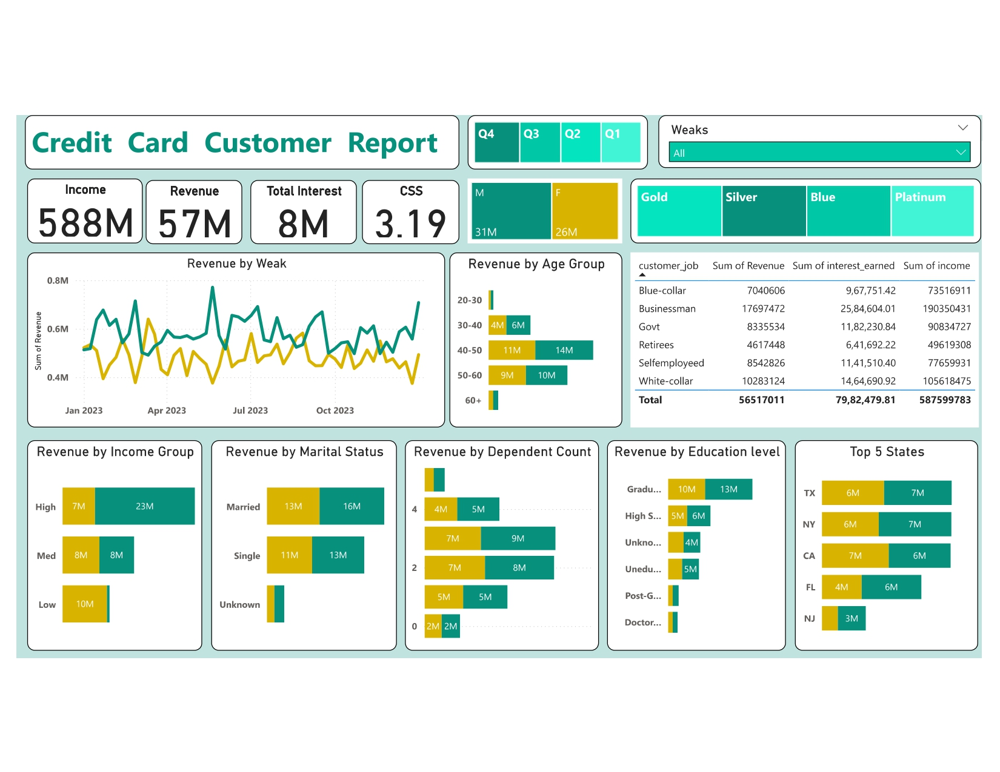
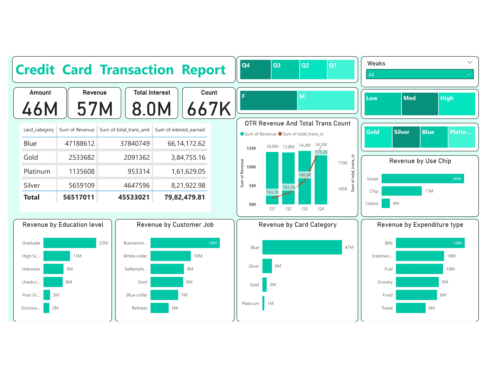

# Credit Card Customer Analysis Dashboard

This project involved building a comprehensive Power BI "Credit Card Financial Dashboard" for in-depth financial data analysis. It covered the entire process from connecting to an SQL database and processing data with DAX to designing interactive customer and transaction reports. The project highlights my skills in data integration, advanced analytics, and deploying impactful business intelligence solutions on platforms like GitHub.

## Overview

This project demonstrates expertise in Power BI by developing a complete "Credit Card Financial Dashboard." It encompasses data extraction from an SQL database, advanced data processing using DAX, and the creation of two detailed dashboards for customer and transaction insights. The successful deployment of this analytical solution on GitHub showcases a holistic understanding of business intelligence development and deployment.

## Key Dashboards and Insights

Based on the provided reports, here are some of the key areas covered and potential insights:

**1. Credit Card Customer Report:**




* **Revenue Performance:** This dashboard tracks the sum of revenue over different quarters (Q1-Q4) and provides an overall view. It also breaks down revenue by week, allowing for the identification of peak and low-performing periods.
* **Customer Demographics:** Insights into revenue generated by different age groups (20-30, 30-40, 40-50, 50-60, 60+), customer jobs (Blue-collar, Businessman, Govt, Retirees, Self-employed, White-collar), gender (Male, Female), card type (Gold, Silver, Blue, Platinum), marital status (Married, Single, Unknown), dependent count, and education level. This allows for the identification of high-value customer segments.
* **Income and Interest:** The dashboard also presents the sum of income and total interest earned, providing a financial perspective on customer contributions.
* **Geographic Distribution:** The "Top 5 States" visualization highlights the states with the highest revenue generation.

**Potential Insights:**

* Identify which customer segments (based on age, job, education, etc.) contribute the most to revenue.
* Understand the revenue trends across different quarters and weeks.
* Analyze the relationship between customer income and revenue generation.
* Determine the performance of different card categories.
* Identify key geographic markets.

**2. Credit Card Transaction Report:**



* **Transaction Volume and Amount:** This dashboard focuses on transaction metrics, including the sum of total transaction amount and the count of transactions.
* **Revenue Breakdown:** Similar to the Customer Report, this dashboard also shows the sum of revenue but potentially with a focus on transaction-related attributes.
* **Channel Analysis:** Insights into revenue generated through different transaction channels (Swipe, Chip, Online).
* **Expenditure Analysis:** The "Revenue by Expenditure type" visualization categorizes spending (Bills, Entertainment, Fuel, Grocery, Food, Travel), offering a view into how customers are using their credit cards.

**Potential Insights:**

* Understand the preferred transaction methods of customers.
* Analyze spending patterns across different expenditure categories.
* Compare revenue generated versus the total transaction amount.
* Identify any correlations between card category and transaction behavior.

## How to Use These Dashboards

**Prerequisites:**

* **Power BI Desktop:** Install from [Microsoft Power BI](https://powerbi.microsoft.com/).
* **Basic Power BI Knowledge:** Familiarity with report navigation and visuals is helpful.

**Setup:**

1.  **Clone Repo (Optional):** If `.pbix` files are present, clone the repository:
    ```bash
    git clone [https://github.com/yourusername/Credit_Card_Financial_Dashboard.git](https://github.com/yourusername/Credit_Card_Financial_Dashboard.git)
    ```
2.  **Open PBIX (If applicable):** Open the `.pbix` file in Power BI Desktop.
3.  **Explore:** Navigate tabs and visuals.

**Usage:**

* **Filter:** Use slicers (e.g., by time, demographics, card type, transaction). 
* **Drill Down:** Click on visuals for more detail (if enabled).
* **Analyze Metrics:** Review KPIs like Revenue, Transaction Amount, Interest, Count.
* **Identify Trends:** Look for patterns in the data.
* **Export/Customize (Desktop):** Export data/visuals or modify them in Power BI Desktop.

